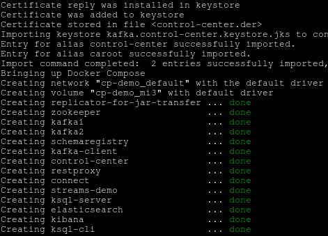
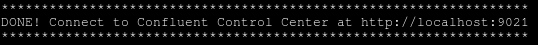

= ДЗ по занятию 20

== 1. Разверните и подготовьте окружение

 

```
...
...
...
```

 

== 2. Создайте KSQL Stream WIKILANG

Посмотрите какие топики есть сейчас в системе, и на основе того, в котором вы видите максимальный объем данных создайте stream по имени WIKILANG который фильтрует правки только в разделах национальных языков, кроме английского (поле channel вида #ru.wikipedia), который сделали не боты.

Stream должен содержать следующие поля: createdat, channel, username, wikipage, diffurl

=== Решение.

wikipedia.parsed - стрим, где на текущий момент больше всего данных, а также самое большое потребление (consumed per second)

Поскольку есть условие при создании стрима, то мы будем использовать streaming ETL.
https://www.confluent.io/stream-processing-cookbook/ksql-recipes/data-filtering/

Смотрим какие есть стримы

```
ksql> show streams;

 Stream Name              | Kafka Topic                 | Format 
-----------------------------------------------------------------
 EN_WIKIPEDIA_GT_1_COUNTS | EN_WIKIPEDIA_GT_1_COUNTS    | AVRO   
 EN_WIKIPEDIA_GT_1_STREAM | EN_WIKIPEDIA_GT_1           | AVRO   
 KSQL_PROCESSING_LOG      | default_ksql_processing_log | JSON   
 WIKIPEDIA                | wikipedia.parsed            | AVRO   
 WIKIPEDIABOT             | WIKIPEDIABOT                | AVRO   
 WIKIPEDIANOBOT           | WIKIPEDIANOBOT              | AVRO   
-----------------------------------------------------------------
```

У нас уже есть стрим, основанный на wikipedia.parsed, это wikipedia.
Более того, есть стрим wikipedianobot, он-то нам и нужен.
Поэтому не будем изобретать велосипед, а создадим стрим на его основе.
Убедимся, что стрим тот, который нам подходит (смотрим на его запрос)

```
describe extended wikipedia;
describe extended wikipedianobot;
```

```
create stream wikilang as
  select createdat, channel, username, wikipage, diffurl
  from wikipedianobot
  where wikipedianobot.channel <> '#en.wikipedia' and wikipedianobot.channel like '%.wikipedia';
```

== 3. Мониторинг WIKILANG

=== После 1-2 минут работы откройте Confluent Control Center и сравните пропускную способность топиков WIKILANG и WIKIPEDIANOBOT, какие числа вы видите?

==== Решение

Вижу такие цифры

```
wikilang 381
wikipedianobot 1283
```

Отличие потоков сообщений от неботов на всех языках и на английском примерно в 4 раза.

===== Дополнительно

Создал таблицу на основе стрима wikilang, чтобы посмотреть "слепок" с этого потока по каналам.

[source, sql]
----
ksql> create table wikilang_tbl as select channel, count(*) from wikilang group by channel;
----

 

=== В KSQL CLI получите текущую статистику вашего стрима

describe extended wikilang;

Приложите полный ответ на предыдущий запрос к ответу на задание.

```
ksql> describe extended wikilang;

Name                 : WIKILANG
Type                 : STREAM
Key field            : 
Key format           : STRING
Timestamp field      : Not set - using <ROWTIME>
Value format         : AVRO
Kafka topic          : WIKILANG (partitions: 2, replication: 2)

 Field     | Type                      
---------------------------------------
 ROWTIME   | BIGINT           (system) 
 ROWKEY    | VARCHAR(STRING)  (system) 
 CREATEDAT | BIGINT                    
 CHANNEL   | VARCHAR(STRING)           
 USERNAME  | VARCHAR(STRING)           
 WIKIPAGE  | VARCHAR(STRING)           
 DIFFURL   | VARCHAR(STRING)           
---------------------------------------

Queries that read from this STREAM
-----------------------------------
CTAS_WIKILANG_TBL_8 : CREATE TABLE WIKILANG_TBL WITH (KAFKA_TOPIC='WIKILANG_TBL', PARTITIONS=2, REPLICAS=2) AS SELECT
  WIKILANG.CHANNEL "CHANNEL",
  COUNT(*) "KSQL_COL_1"
FROM WIKILANG WIKILANG
GROUP BY WIKILANG.CHANNEL
EMIT CHANGES;

For query topology and execution plan please run: EXPLAIN <QueryId>

Queries that write from this STREAM
-----------------------------------
CSAS_WIKILANG_7 : CREATE STREAM WIKILANG WITH (KAFKA_TOPIC='WIKILANG', PARTITIONS=2, REPLICAS=2) AS SELECT
  WIKIPEDIANOBOT.CREATEDAT "CREATEDAT",
  WIKIPEDIANOBOT.CHANNEL "CHANNEL",
  WIKIPEDIANOBOT.USERNAME "USERNAME",
  WIKIPEDIANOBOT.WIKIPAGE "WIKIPAGE",
  WIKIPEDIANOBOT.DIFFURL "DIFFURL"
FROM WIKIPEDIANOBOT WIKIPEDIANOBOT
WHERE ((WIKIPEDIANOBOT.CHANNEL <> '#en.wikipedia') AND (WIKIPEDIANOBOT.CHANNEL LIKE '%.wikipedia'))
EMIT CHANGES;

For query topology and execution plan please run: EXPLAIN <QueryId>

Local runtime statistics
------------------------
consumer-messages-per-sec:      1.88 consumer-total-bytes:    171621 consumer-total-messages:      1100 messages-per-sec:      1.88   total-messages:      1258     last-message: 2020-03-21T21:13:40.701Z

(Statistics of the local KSQL server interaction with the Kafka topic WIKILANG)
```

- В KSQL CLI получите текущую статистику WIKIPEDIANOBOT: descrbie extended wikipedianobot;

Приложите раздел Local runtime statistics к ответу на задание.

```
Local runtime statistics
------------------------
consumer-messages-per-sec:      5.81 consumer-total-bytes:   1036686 consumer-total-messages:      4540 messages-per-sec:      5.80   total-messages:      6612     last-message: 2020-03-21T21:18:58.192Z
```

Почему для wikipedianobot интерфейс показывает также consumer-* метрики?

==== Ответ

Собственно, у меня и для wikilang показывались consumer-* метрики.
Что интересно, что в предыдущие запуски ДЗ их не было.
Появились только после того как я создал таблицу wikilang_tbl (см. выше), чтобы просмотреть аггрегацию по к-ву каналов и выполнил по ней запрос `select * from wikilang_tbl emit changes`.

Вывод: consumer-* метрики есть тогда, когда у стрима есть консьюмеры =)

Ранее у wikilang consumer-* метрик не было, т.к. по нему не было никаких запросов с фразой `emit changes`, которая, как я понял, инициирует непрерывное обновление результата запроса.

== 3.1. Некоторые особенности и наблюдения

Спустя какое-то время стримы википедии как-то "иссякали" (produced per sec и consumed per sec становилось 0), приходилось останавливать и запускать заново cp-demo.

Не уверен, в этом ли дело, но так получилось, что я, чтобы обновить offset, который, возможно, "сбивался" (в результате чего я не видел никаких новых сообщений при просмотре потока), я выполнял команду установки смещения "в начало":
`ksql> SET 'auto.offset.reset' = 'earliest';`

После этого топики и стримы "оживлялись" и уже не "иссякали".

== 4. Добавьте данные из стрима WIKILANG в ElasticSearch

- Добавьте mapping - запустите скрипт set_elasticsearch_mapping_lang.sh
- Добавьте Kafka Connect - запустите submit_elastic_sink_lang_config.sh
- Добавьте index-pattern - Kibana UI -> Management -> Index patterns -> Create Index Pattern -> Index name or pattern: wikilang -> кнопка Create

Используя полученные знания и документацию ответьте на вопросы:  

a) Опишите что делает каждая из этих операций?

- set_elasticsearch_mapping_lang.sh +
  Передаем через restful api эластика маппинг - структуру данных, которые будем читать.

- submit_elastic_sink_lang_config.sh +
  Конфигурируем кафка sink-коннектор для созданного нами wikilang. +
  Как я понял, с использованием schemaregistry.

 

б) Зачем Elasticsearch нужен mapping чтобы принять данные?

Кафка ничего не знает и не сообщает о структуре данных внутри себя.
Это забота подключающихся к ней приложений.
Мы определяем в эластике структуру данных, которые будем читать из кафки, при помощи mapping api эластика:
https://www.elastic.co/guide/en/elasticsearch/reference/current/mapping.html

в) Что дает index-pattern?

An index pattern tells Kibana which Elasticsearch indices contain the data that you want to work with.

То есть, как я понял, index pattern - это представление в кибане индекса, который содержится в эластике.
На основе этого представления мы уже можем строить различную визуализацию, отчеты.

 

Представление это "рид онли", т.е., как написано выше на скрине, если нужно изменить структуру данных, необходимо использовать снова mapping api.

== 5. Создайте отчет "Топ10 национальных разделов" на базе индекса wikilang

- Kibana UI -> Visualize -> + -> Data Table -> выберите индекс wikilang
- Select bucket type -> Split Rows, Aggregation -> Terms, Field -> CHANNEL.keyword, Size -> 10, нажмите кнопку Apply changes (выглядит как кнопка Play)
- Сохраните визуализацию под удобным для вас именем

Что вы увидели в отчете?

Аггрегацию количества записей с группировкой по каналу нашего стрима wikilang.

[source]
----
#de.wikipedia	511
#fr.wikipedia	298
#ru.wikipedia	207
#es.wikipedia 	206
#it.wikipedia	197
#uk.wikipedia	85
#mediawiki.wikipedia	67
#zh.wikipedia	40
#eu.wikipedia	11
#sd.wikipedia	10
----

NOTE: Возможно, #mediawiki.wikipedia также нужно было отфильтровать :)

- Нажав маленьку круглую кнопку со стрелкой вверх под отчетом, вы сможете запросить не только таблицу, но и запрос на Query DSL которым он получен.

Приложите тело запроса к заданию.

[source, json]
----
{
  "size": 0,
  "query": {
    "bool": {
      "must": [
        {
          "match_all": {}
        },
        {
          "range": {
            "CREATEDAT": {
              "gte": 1584827107375,
              "lte": 1584828007376,
              "format": "epoch_millis"
            }
          }
        }
      ],
      "must_not": []
    }
  },
  "_source": {
    "excludes": []
  },
  "aggs": {
    "2": {
      "terms": {
        "field": "CHANNEL.keyword",
        "size": 10,
        "order": {
          "_count": "desc"
        }
      }
    }
  }
}
----
